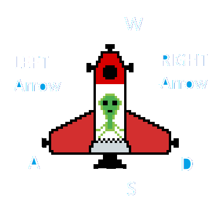

# How to play:
## General Instructions:
+ Before playing, Go through <i><b>Game Play.pdf</b></i> 
and <i><b>Game Play.mp4</b></i>
+ [Click here for Game Play video](https://drive.google.com/file/d/1Lu9j93m4z_3o21UGwGf2uP7susCLAhyu/view?usp=sharing)
+ Then Go through <i><b>How to Play.md</b></i> file
+ Then start the game.

## Story:
You are in a space pod (a small spaceship) and must 
maneuver it to collect stars before the fuel runs out. 

However, planets and black holes will try to drag your pod 
towards them, and you must control it in such a way that you 
avoid colliding with them. There are also wormholes that 
transfer you from one wormhole to the next. 

## Instructions:
+ Move the POD with W-A-S-D Keys as shown
+ Rotate the POD with Left and Right arrow keys

+ Remember you are in a space pod. So controls will be relative.
+ Collect all stars to complete the level
+ Do not crash into planets
+ Planets exerts gravitational pull
+ Black Holes have higher gravitational pull
+ Worm holes are portals from one location to other
+ Options:
  * Gravitational pull can be turned on/off from *Options*
  * Fuel meter can be turned on/off from *Options*
  * Music/Sound can be turned on/off from *Options*